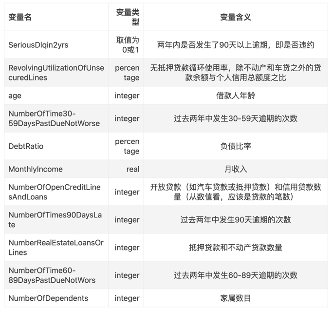

## adult的数据结果

### 数据划分
- 将历史是否逾期的特征、开放贷款、历史逾期次数等特征挑选出来当作另外一方的特征
### 数据构造
- 根据划分构造两部分双方数据
### 特征融合
- 水平聚合
- 层次聚合
- 联合训练
> https://github.com/alibaba/Elastic-Federated-Learning-Solution/blob/54e4facd5da809672f1df37dc0767d5704f70a83/efls-algo/README.md
